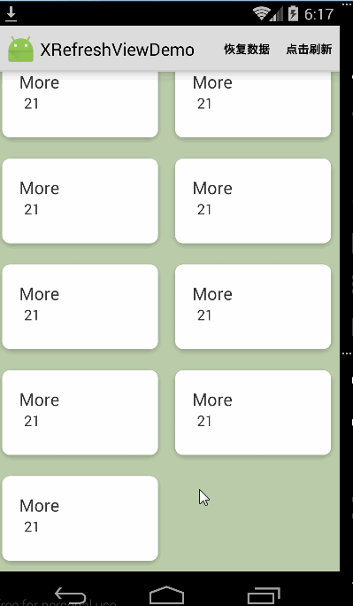
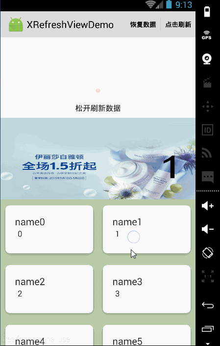
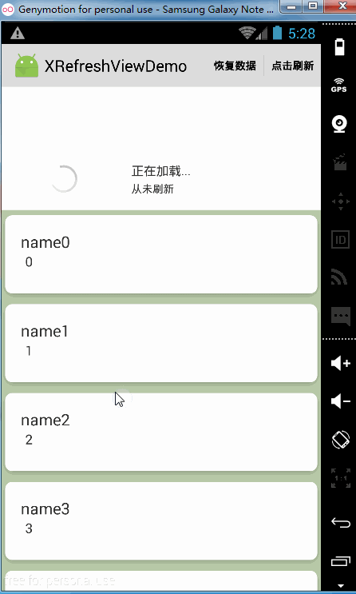
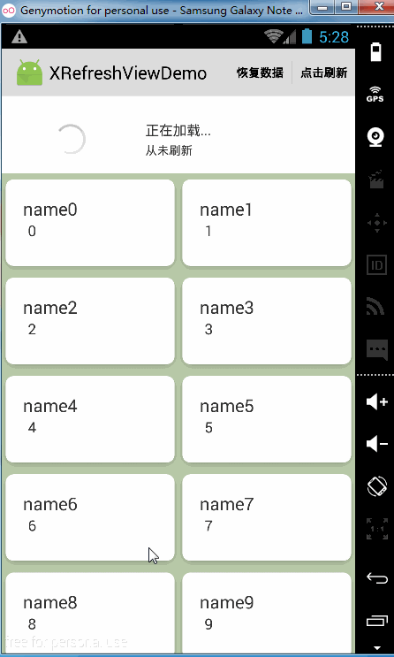
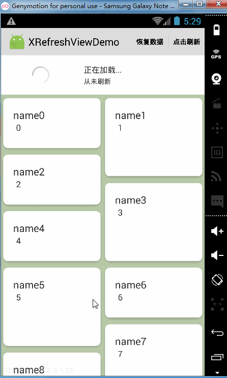
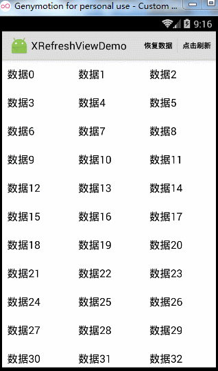
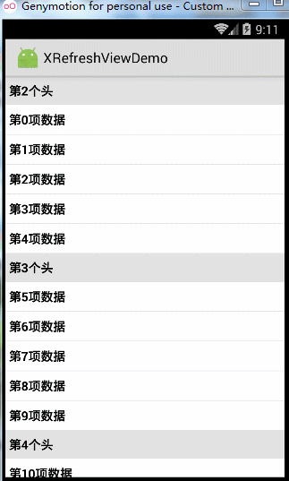
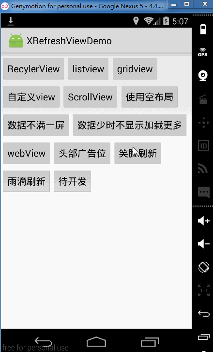

# XRefreshView

### Usage
----

#### Gradle

```groovy
dependencies {
   compile 'com.huxq17.xrefreshview:xrefreshview:3.6.5'
   //依赖下面的库
   compile 'com.android.support:recyclerview-v7:23.0.1'
   compile 'com.android.support:support-v4:23.0.1'
}
```

## 最新的使用说明请移步[我的博客](http://blog.csdn.net/footballclub/article/details/46982115 "description")

## 效果图

|松开加载更多的Recyclerview|带Banner的Recyclerview| LinearLayout样式的Recyclerview|
|:-----|:-----|:-----|
|  |  |  |

|GridLayout样式的Recyclerview|Staggered样式的Recyclerview|
|:-----|:-----|
| | |

|GridView|自定义View|笑脸刷新|
|:-----|:-----|:-----|
| | ||

还有listview,scrollview，webview等其他的view就不一一截图了。**建议把此项目下载下来，然后跑到手机上看效果，例子都在app module里。**

### 更新日志：<br/>
    2017-3-28：
    1.不再强制Recyclerview使用BaseRecyclerAdapter,当不使用BaseRecyclerAdapter时，RecyclerView会被当成普通view，
    上拉加载等操作和普通view相同，空布局等功能的使用方式也和普通view相同
    2.解决ListView的子项目不足一屏时，上拉时再下拉会出现布局突然缩回的问题
    3.升级到3.6.5版本

    2017-3-27：
    1.解决事先setPullRefreshEnable(false),再setPullRefreshEnable(true)和startRefresh()时，headerview无法显示的问题
    2.升级到3.6.3版本
    
    2017-2-17：
    1.添加下拉刷新时的回调onRefresh(boolean isPullDown)，其中isPullDown用来判断此次下拉刷新是不是由下拉手势触发的，true则代表是，
    反之则是自动刷新或者是调用XRefreshView#startRefresh()}触发的刷新
    2.升级到3.6.2版本

    2017-2-16：
    1.解决issue[#58](https://github.com/huxq17/XRefreshView/issues/58)

    2017-1-13：
    1.解决Recyclerview使用StaggeredGridLayoutManager时，添加的headerview不能使用全部宽度的问题(headview layout won't use all span area)

    2017-1-6：
    1.解决issue[#49](https://github.com/huxq17/XRefreshView/issues/49)

    2017-1-4：
    1.解决AbsListview数据不满一屏的时候，会重复加载更多的问题

    2016-12-15：
    1.优化非RecyclerView上拉加载回弹的效果，同时支持AbsListView(ListView、GridView)加载更多数据完成之后露出新加载的数据

    2016-9-28：
    1.添加xscrollview的滑动监听

    2016-9-6：
    1.解决issue[#36](https://github.com/huxq17/XRefreshView/issues/36)

    2016-8-19：
    1.添加没有数据时显示空布局的支持
    2.解决6.0以下的手机，在调用startRefresh()方法后，刷新时headerview有时会不显示的问题
    3.其他一些优化

    2016-8-8：
    1.添加下拉刷新，数据接收失败的ui处理
    2.解决下拉刷新，在刷新状态下把headerview完全隐藏掉，在刷新结束以后下拉和上拉都不可用的问题


### 关于我
    邮箱：huxq17@163.com
    ps:有问题联系我的话请不要问我在不在，直接说问题，谢谢。

### License

    Copyright (C) 2015 huxq17

    Licensed under the Apache License, Version 2.0 (the "License");
    you may not use this file except in compliance with the License.
    You may obtain a copy of the License at

    http://www.apache.org/licenses/LICENSE-2.0

    Unless required by applicable law or agreed to in writing, software
    distributed under the License is distributed on an "AS IS" BASIS,
    WITHOUT WARRANTIES OR CONDITIONS OF ANY KIND, either express or implied.
    See the License for the specific language governing permissions and
    limitations under the License.

