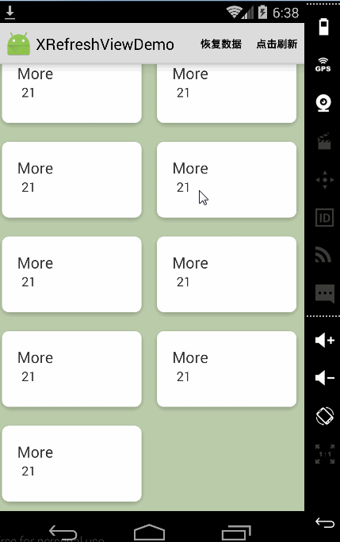

# XRefreshView

###Usage
----

#### Gradle

```groovy
dependencies {
   compile 'com.huxq17.xrefreshview:xrefreshview:3.5.5'
   //依赖下面的库
   compile 'com.android.support:recyclerview-v7:23.0.1'
   compile 'com.android.support:support-v4:23.0.1'
}
```

##最新的使用说明请移步[我的博客](http://blog.csdn.net/footballclub/article/details/46982115 "description")
##效果图
|松开加载更多的Recyclerview|带Banner的Recyclerview| LinearLayout样式的Recyclerview|
|:-----|:-----|:-----|
|     |  |  |

|GridLayout样式的Recyclerview|Staggered样式的Recyclerview|
|:-----|:-----|
| | |

|GridView|自定义View|笑脸刷新|
|:-----|:-----|:-----|
| | ||

还有listview,scrollview，webview等其他的view就不一一截图了。建议把此项目下载下来，然后跑到手机上看效果，例子都在app module里。

### 更新日志：<br/>
    2016-9-28：
    1.添加xscrollview的滑动监听

    2016-9-6：
    1.解决issue[#36](https://github.com/huxq17/XRefreshView/issues/36)

    2016-8-19：
    1.添加没有数据时显示空布局的支持
    2.解决6.0以下的手机，在调用startRefresh()方法后，刷新时headerview有时会不显示的问题
    3.其他一些优化

    2016-8-8：
    1.添加下拉刷新，数据接收失败的ui处理
    2.解决下拉刷新，在刷新状态下把headerview完全隐藏掉，在刷新结束以后下拉和上拉都不可用的问题


### 关于我
    QQ群：537610843 (加群备注：XRefreshView)
    邮箱：huxq17@163.com

### License

    Copyright (C) 2015 huxq17

    Licensed under the Apache License, Version 2.0 (the "License");
    you may not use this file except in compliance with the License.
    You may obtain a copy of the License at

    http://www.apache.org/licenses/LICENSE-2.0

    Unless required by applicable law or agreed to in writing, software
    distributed under the License is distributed on an "AS IS" BASIS,
    WITHOUT WARRANTIES OR CONDITIONS OF ANY KIND, either express or implied.
    See the License for the specific language governing permissions and
    limitations under the License.

